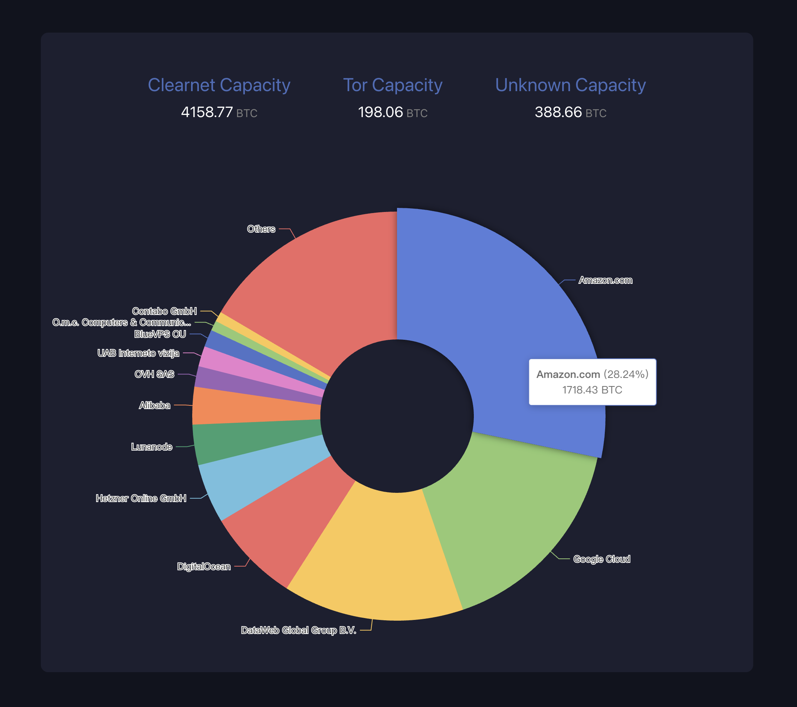

# BTC ISPs Nodes Ranking Chart



## Technology used
- Express
- Typescript
- React.js
- Echarts
- Mempool API
- axios, nodemon, cors, ts-node

## Getting started
```
cd frontend
npm install
cd ..
cd backend
npm install
```
This step will install all the dependencies needed for the application

## Running the application
```
cd backend
npm run start
cd ..
cd backend
npm run start
```
The application will automatically start on http://localhost:3001

By using `nodemon`, we enable the hot-update while developing, which saves lots of time.

Also by using `ts-node`, we can simply run the server by only 1 command.


